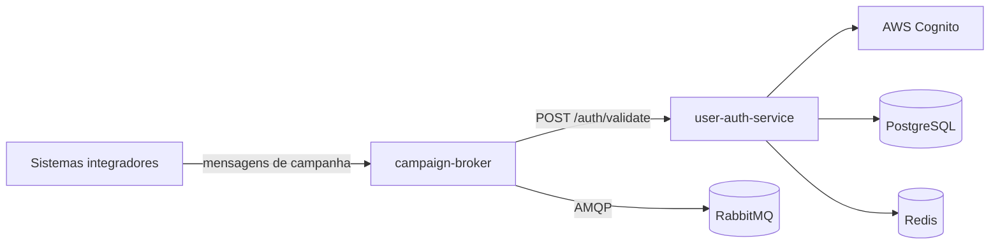

### Olá, eu sou o Leonardo 👋

Desenvolvedor backend com foco em **Go**, também com experiência em **Python/Django**. Trabalho com microsserviços, mensageria assíncrona e autenticação, com testes automatizados e cobertura acima de 80% nos projetos principais.

**Stack:** Go · Gin · RabbitMQ · PostgreSQL · GORM · Redis · AWS Cognito · OAuth2/JWT · Docker · Python · Django

#### Projetos principais (Go)

Os dois serviços se conectam: o `campaign-broker` valida cada requisição chamando o `POST /auth/validate` do `user-auth-service`.

| Projeto | O que é |
| --- | --- |
| [user-auth-service](https://github.com/Leonardoongaratto/user-auth-service) | Serviço de identidade: login e OAuth2 `client_credentials` via AWS Cognito, validação de tokens e API keys para outros serviços, gestão de usuários e permissões, PostgreSQL com conexões de leitura e escrita separadas, cache em Redis, rate limiting e circuit breaker |
| [campaign-broker](https://github.com/Leonardoongaratto/campaign-broker) | Gateway de ingestão de mensagens de campanha WhatsApp: autenticação com cache de tokens, download de mídia com streaming para Base64 e publicação em filas RabbitMQ com pool de canais |

#### Outros projetos

| Projeto | O que é |
| --- | --- |
| [ai-dev-template](https://github.com/Leonardoongaratto/ai-dev-template) | Governança para projetos com agentes de IA (Claude Code e Antigravity): pipeline implementer → reviewer → QA → bug-fixer e setup para Windows e Linux |
| [recipes](https://github.com/Leonardoongaratto/recipes) | Site de receitas em Django com busca, paginação e suíte de testes em pytest |
| [tourist-point-api](https://github.com/Leonardoongaratto/tourist-point-api) | API REST de pontos turísticos em Django REST Framework |

📫 [LinkedIn](https://www.linkedin.com/in/leonardoongaratto/)
